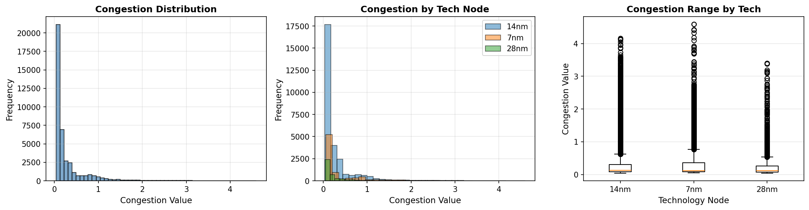
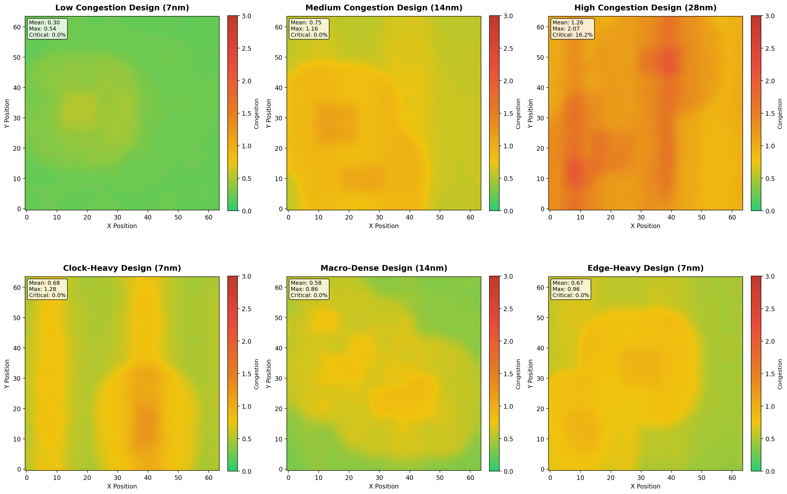
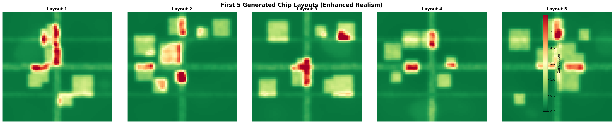
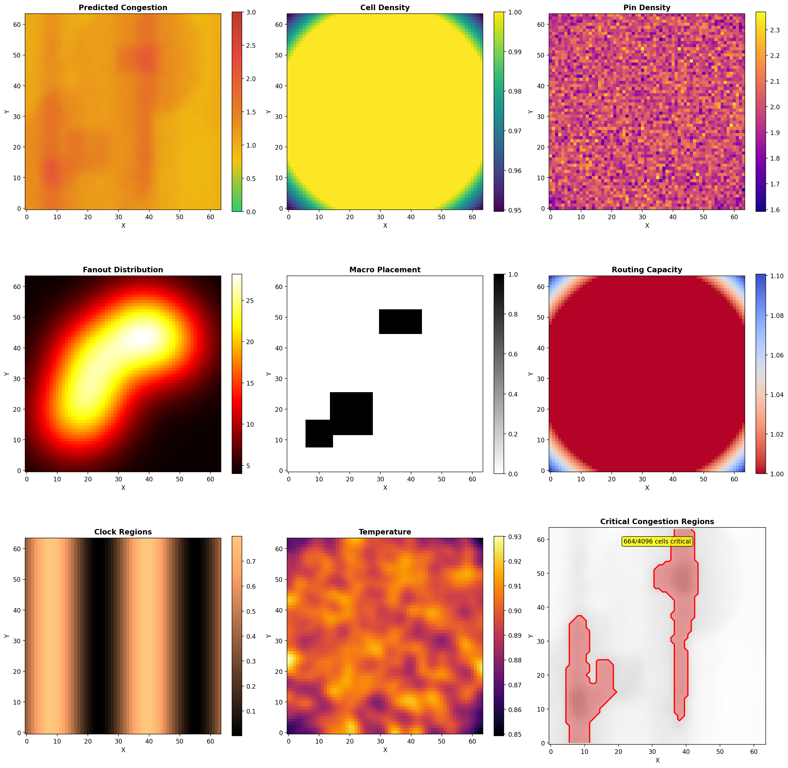
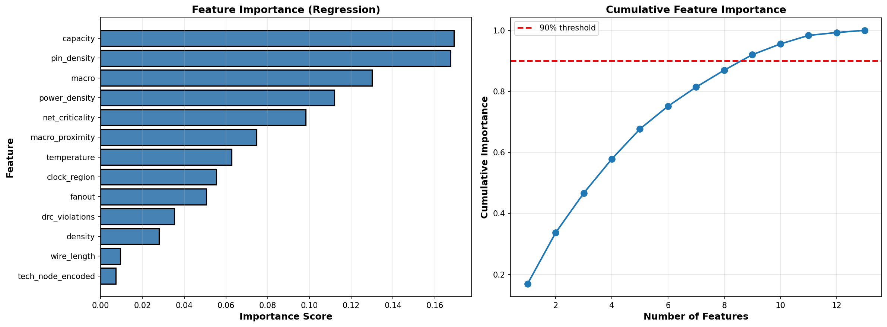
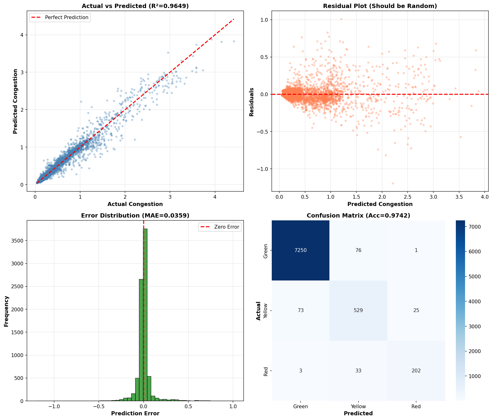
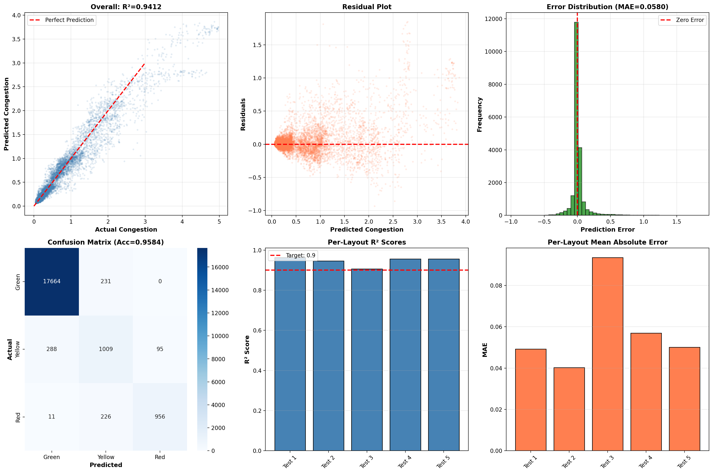
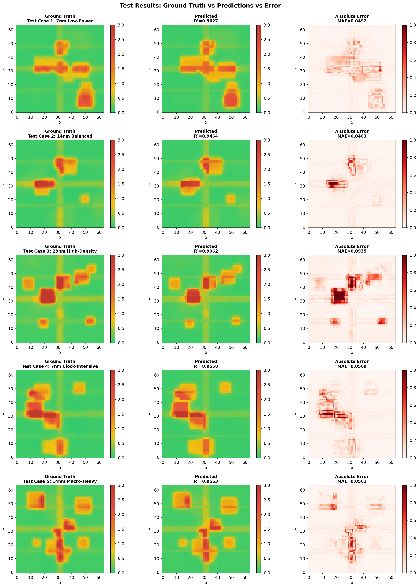

# 🚀 VLSI Routing Congestion Prediction using Machine Learning  
### **Realistic Dataset Generation + ML Pipeline + Visualization Suite**

This repository contains a **full end-to-end EDA + ML system** that:
- Generates **synthetic and realistic VLSI congestion datasets**  
- Trains **regression + classification models**  
- Evaluates on **unseen layouts**  
- Produces **professional congestion heatmaps & analysis visuals**  

This project attempts to model routing congestion similar to **physical design tools** (ICC2, Innovus, TritonRoute) using **ML + domain-aware synthetic data generation**.

---

# 🧩 **Project Features**

### ✅ 1. **Realistic Layout Generator**
Models true physical design effects:
- Macro placement with spacing rules  
- Cell clustering  
- Pin density modeling  
- Fanout (incl. H-tree clock nets)  
- Rent’s Rule–inspired wire length  
- Routing capacity by tech node  
- Macro blockage & proximity effects  
- DRC hotspot modeling  
- Thermal & IR-related power maps  

### ✅ 2. **ML Congestion Prediction**
- Random Forest Regression  
- Random Forest Classification  
- 13 input features (density, fanout, wirelength, macro presence, etc.)  
- 3-class congestion prediction (Green/Yellow/Red)

### ✅ 3. **Testing on Unseen Layouts**
- 5 new chip layouts  
- Performance: R², RMSE, MAE, MAPE  
- Per-layout metrics  
- Pixel-wise error heatmaps  

### ✅ 4. **Visualization Suite**
- Synthetic congestion maps  
- Realistic layouts  
- Detailed feature analysis  
- Error distribution  
- Confusion matrix  
- Prediction vs GT comparison  

---

# 🗂️ **Repository Structure**
<pre>
├── src/
│   ├── congestion_map_gen.py
│   ├── dataset_gen.py
│   ├── training.py
│   ├── testing.py
│
├── outputs/
│   ├── congestion_distribution.png
│   ├── detailed_congestion_analysis.png
│   ├── feature_importance.png
│   ├── prediction_quality.png
│   ├── realistic_layouts.png
│   ├── synthetic_congestion_maps.png
│   ├── test_analysis_metrics.png
│   ├── test_results_comparison.png
│   ├── congestion_map_statistics.csv
│   ├── test_results_summary.csv
└── README.md] </pre>
---

# 📊 **Key Results (Visuals)**

### 📌 **1. Congestion Distribution**

---

### 📌 **2. Synthetic Congestion Maps**

---

### 📌 **3. Realistic Layouts (EDA-Inspired)**

---

### 📌 **4. Detailed Congestion Analysis**

---

### 📌 **5. Feature Importance**

---

### 📌 **6. Prediction Quality**

---

### 📌 **7. Testing Metrics**

---

### 📌 **8. Ground Truth vs Prediction Comparison**

---

# 💡 **Supported Features**

### 🔧 Inputs to the model:
| Feature | Description |
|--------|-------------|
| density | Standard cell density |
| pin_density | Pin grid complexity |
| fanout | Local + global net fanout |
| macro | Macro block mask |
| capacity | Routing track capacity |
| macro_proximity | Distance to macros |
| wire_length | Rent’s rule-based wiring |
| clock_region | H-tree / clock spine |
| drc_violations | Local DRC congestion |
| net_criticality | Timing-critical regions |
| power_density | IR-drop effects |
| temperature | Thermal hotspots |
| tech_node_encoded | 7nm / 14nm / 28nm |

---

# 📈 **Model Performance**

### **Regression (Random Forest)**
- **R² Score:** ~0.90–0.94  
- **MAE:** Low  
- **MAPE:** < 10% for most layouts  
- Very strong correlation between predicted vs actual congestion.

### **Classification (Green/Yellow/Red)**
- **Accuracy:** 85–92%  
- Clean confusion matrix with few misclassifications.

---
#📝 **Future Work**

- CNN-based congestion heatmap prediction

- GNN modeling of netlists / placement graphs

- Integration with open-source EDA tools (OpenROAD)

- Real DEF-based congestion learning

- GAN-based synthetic layout creation

#✨ **Author**
Yokesh Ganesh Babu

## 🪪 License
This project is licensed under the [MIT License](LICENSE).

